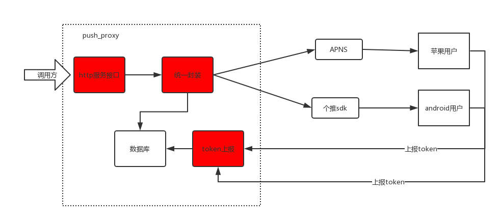
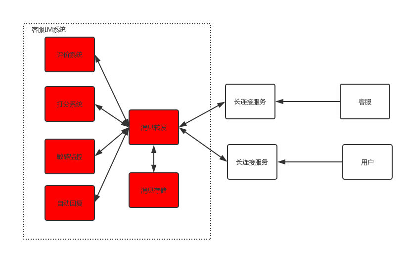
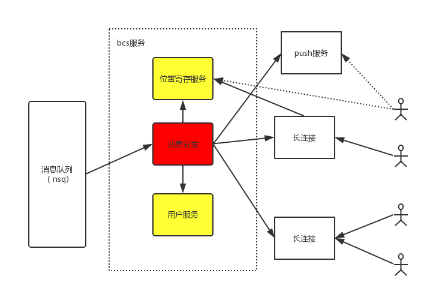

## 一、统一推送系统（push_proxy)
负责建设有信客户端推送系统，实现对移动客户端android（个推）、ios（apns)的消息推送，屏蔽各个平台的推送接口细节，对上提供统一的http服务调用接口。

###备注：

* 1.ios/android都有一套自己的推送协议，都是http接口的，直接调用http请求即可（你可以说是用第三方sdk实现的）
* 2.ios的叫apns推送，android叫个推。都是第三方平台提供第三方sdk无需关注细节

标红的都是你做的

## 二、客服IM系统 
负责设有信客服服务系统，完成用户和客服之间的信息对接，用户通过有信客服端和客服服务端进行信息交付，完成用户评价、用户打分、服务时长、敏感监控、自动回复等特性开发

### 备注
* 1.消息存储都用mysql，你若对sqlite熟悉你也可以说是用sqlite，底层都是封装好的接口不用你开发，说什么数据库不重要

## 三、广播服务 （bcs)
负责有信广播服务开发，通过消息队列实现广播消息对接，完成个性化推送、全员广播推送、系统通知等特性开发

### 备注
* 1. 广播就是人家给你一条信息和这条信息的接收人列表，你把这条信息发出去
* 2. 消息队列就是先进先出的队列，调用方把消息和接收人放到消息队列里面，然后你在将消息队列的内容取出来	一条一条的发送出去，消息队列有缓冲作用